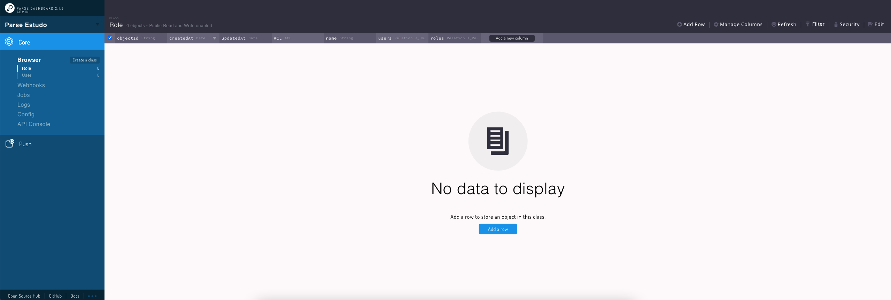

# Parse Backend & Dashboard Example 📑

<p align="center">
  
</p>

<p align="center">

[
](https://dev.to/tuliocalil)

</p>

## Sobre📖

Projeto de exemplo utilizado para escrever o post: [ainda escrevendo rsrs]()

[Here](https://www.figma.com/file/ywNwI4gYMH3cXiUIZ9ZiuS/summaryze-dev?node-id=0%3A1) you can see the figma prototype.

## Como usar ❓

Clone o projeto

```bash
git clone https://github.com/tuliocll/parse-backend-example.git
```

Instale as dependências:

```bash
yarn
#ou
npm i
```

Rode o projeto

```bash
yarn start
#ou
npm start
```

Acesse a url do terminal. Usuario e senha padrão: User: `admin` Password: `admin`

### Buy me a coffe! ☕

[
](https://ko-fi.com/tuliocll)

<div align="center">

### Made with 💙 in Bahia, Brasil.

</div>
